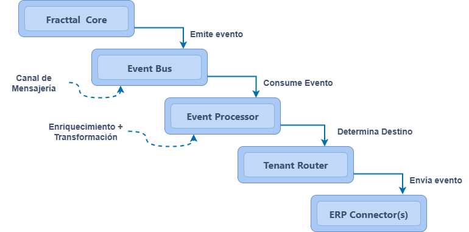

# Arquitectura de Integración en Tiempo Real – Fracttal
## 1. Objetivo
El objetivo de esta propuesta es diseñar una arquitectura de integración **escalable**, **desacoplada** y **multitenant** que permita conectar **Fracttal** con diversos sistemas **ERP** en **tiempo real**, eliminando el uso de estrategias de *polling* y reduciendo el consumo innecesario de recursos.
La idea es transformar el modelo actual en un ecosistema **event-driven (EDA)**, donde cada cambio relevante en Fracttal dispare un evento procesable que pueda ser consumido por cualquier ERP conectado. Con esto buscamos:
- Emitir eventos automáticamente ante cualquier modificación significativa.
- Procesar, transformar y entregar los datos de forma segura, confiable y extensible.
- Reutilizar reglas y transformaciones existentes.
- Contar con trazabilidad, reintentos automáticos y gestión robusta de errores.
- Escalar horizontalmente para soportar miles de empresas en paralelo.

---

## 2. Componentes de la Arquitectura

La solución propuesta se basa en un diseño **orientado a eventos (EDA)**, donde cada componente está **desacoplado** y puede evolucionar, reemplazarse o escalar de forma independiente sin afectar al resto del sistema:

| Componente | Rol | Función Principal |
|------------|-----|--------------------|
| **Event Emitter (Fracttal)** | Productor | Detecta cambios en el sistema y genera eventos estructurados en tiempo real. |
| **Event Bus / Message Broker** | Canal de Mensajería | Desacopla emisores y consumidores, garantizando entrega, persistencia, orden y reintentos. |
| **Event Processor / Transformer** | Procesador | Consume eventos, aplica reglas de negocio y transforma los datos al formato requerido por cada ERP. |
| **Tenant Router** | Enrutador Multitenant | Determina el ERP de destino y gestiona credenciales, endpoints y configuraciones por cliente. |
| **ERP Connectors** | Adaptadores | Entregan los eventos transformados al ERP correspondiente mediante REST, SOAP, GraphQL, etc. |
| **Dead Letter Queue (DLQ)** | Resiliencia | Almacena eventos que no pudieron procesarse o entregarse tras múltiples intentos, facilitando su reprocesamiento. |

---

## 3. Flujo de Integración

El flujo completo de la integración sigue el siguiente proceso:

1. **Emisión del evento:** Fracttal genera un evento mediante webhooks, patrón *Outbox* o *Change Data Capture (CDC)* cuando ocurre un cambio.  
2. **Publicación en el bus:** El evento es enviado al *message broker*.  
3. **Procesamiento y transformación:** El **Event Processor** consume el evento, lo enriquece y transforma según la lógica de negocio.  
4. **Enrutamiento:** El **Tenant Router** determina el ERP destino basándose en su llave unica.  
5. **Entrega:** El **ERP Connector** envía el evento transformado al ERP mediante el protocolo correspondiente.  
6. **Fallback:** Si la entrega falla tras múltiples intentos, el evento se envía a la **DLQ** para su posterior análisis y reprocesamiento.
---

## 4. Diagrama Conceptual (Lógico)

## 5.Beneficios Clave

- **Tiempo real**: elimina completamente el polling.
- **Desacoplada**: cada componente puede evolucionar de forma independiente.
- **Multitenant**: diseñada para escalar horizontalmente a miles de clientes.
- **Resiliente**: tolerancia a fallos con DLQ, reintentos y circuit breakers.
- **Extensible**: permite agregar nuevos ERPs sin modificar la arquitectura base.
- **Observabilidad**: métricas, logs estructurados y trazabilidad de eventos extremo a extremo.

## 6. Conclusión

Esta arquitectura permite a Fracttal evolucionar desde un modelo tradicional basado en polling hacia un ecosistema event-driven moderno, escalable y preparado para el futuro.
Con este enfoque, las integraciones con ERPs no solo se vuelven más eficientes y en tiempo real, sino que además se sientan las bases para una plataforma de integraciones sólida, capaz de incorporar nuevas transformaciones, conectores y modelos de entrega sin cambios drásticos en el núcleo del sistema.
